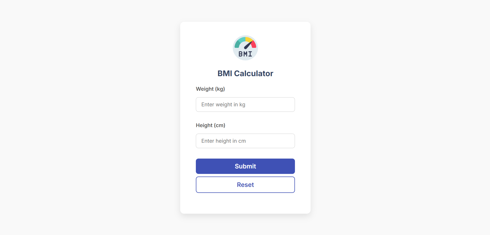
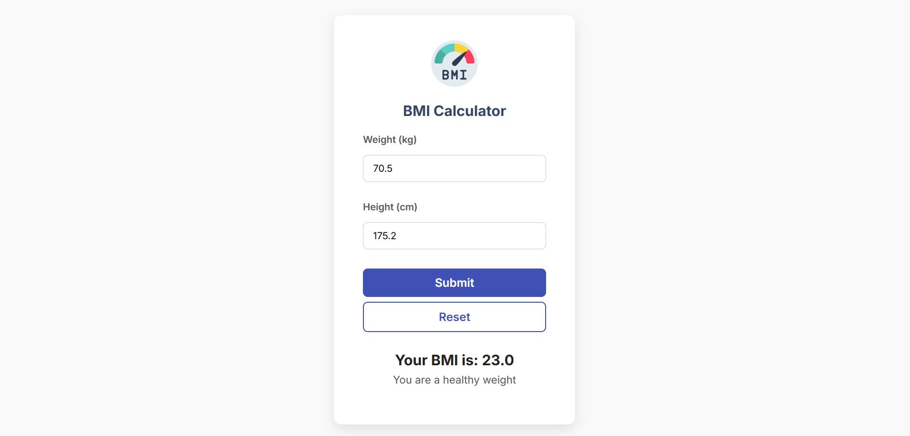

# BMI Calculator React App

A modern, responsive Body Mass Index (BMI) calculator built with React.  
Calculate your BMI easily using metric units (kilograms and centimeters), and get an instant health message based on your result.

---

## Features

- ✅ Lightweight and fast React app  
- ✅ Supports decimal inputs for weight and height  
- ✅ Calculates BMI using the standard formula (kg & cm)  
- ✅ Provides health status messages based on BMI  
- ✅ Clean, modern UI with responsive design  
- ✅ Reset functionality to clear inputs and results  
- ✅ Progressive Web App (PWA) ready with custom icons and manifest  

---

## Screenshots

### 🖼️ Input Form


### 🧮 BMI Result View


---

## Installation

Follow these steps to run the project locally:

1. **Clone the repository**
   ```bash
   git clone https://github.com/karan7638/bmi-calculator-react.git
   ```

2. **Navigate into the project directory**
   ```bash
   cd bmi-calculator-react
   ```

3. **Install dependencies**
   ```bash
   npm install
   ```

4. **Start the development server**
   ```bash
   npm start
   ```

5. Open your browser and go to:  
   [http://localhost:3000](http://localhost:3000)

---

## Usage

1. Enter your **weight** in kilograms (e.g., `70.5`).  
2. Enter your **height** in centimeters (e.g., `175.2`).  
3. Click **Submit** to calculate your BMI and view the health status.  
4. Click **Reset** to clear inputs and results.

---

## Built With

- [React](https://reactjs.org/) – Frontend JavaScript library  
- [CSS3](https://developer.mozilla.org/en-US/docs/Web/CSS) – For modern and responsive styling  

---


## ⭐ Support

If you like this project, please give it a star! ⭐  
It helps others discover it and motivates continued development.
